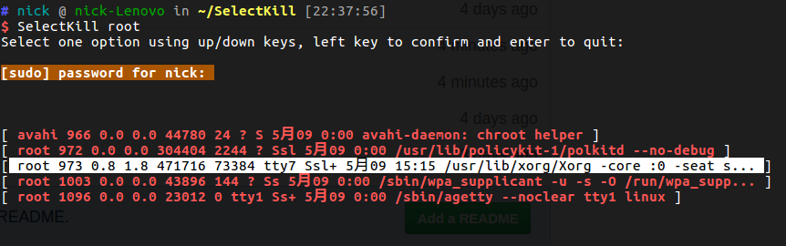

# Intoduction
```SelectKill``` is a simple bash script which interactively and selectively kills a group of processes matching certain pattern.

# Usage
- download the repository
```bash
git clone https://github.com/Gyumeijie/SelectKill.git
```
- cd into the ```SelectKill```, and run the following command
```bash
./install.sh
```
- now you can play with the ```SelectKill``` command

## 1. run ```SelectKill``` with a pattern

 

As shown above, all the processes match the pattern ```root``` will be displayed in the option region, you can use the ```up/down``` keys to select which process you want to kill.

## 2. select the process which requires root priviledge to kill

 

 may you should try second time:
 
 
 
 again, you can try the last time:
 
 
 
 but if you failed for three times, ```SelectKill``` will give you the following message:

 

## 3. select the process which you have permission to kill
Say, you have the root priviledge and then you can kill the process with pid equavilent to ```27237```. Maybe you
need to go through some steps talked above--typing your password.


# Settings
The ```SelectKill``` has two regions: ```message region``` and ```options region```. The message region is used to 
display information, say details of long option which is too long to display in the region; and the options region is 
to show information of processes matching the pattern, if one option is too long, we deprecate it at some point and 
replace the deprecated content with ```...``` and when the long option is being selected we display the original information
back in the message region.

## set size for message region and options region


As shown in the picture above, we can customize the size of both regions in the ```config.ini``` file. Say we can have message region set to ```4 rows``` and option region to ```5 rows```, the following is the corresponding setting:
```
  LISTNUM=5  # size of option region
  MSGNUM=4   # size of message region
```

## set the duration of showing instant message

Instant messages like prompting successfully killing a process or being denied to kill a process should not be always
shown in message region, so we can give them a duration for displaing, say ```1.5 s```, and when the duration is elapsed   we show other messages. The following is the corresponding setting:
```
  SHOW_DURATION=1.5
```

## set the initially selected option

We can also set the initially selected option, the default is not choosing any option in the region, but we
can set it to, say, the first option or any other option. The following is the corresponding setting:
```
  INIT_SELECTED=-1
```
and any invalid value which is less than ```-1``` or greater than the number of total options will be forcibly 
reset to the default ```-1```.

# Todos
- [ ] Prettify processes information shown in the option region.
- [ ] Support refreshing for getting realtime processes information but not a static snapshot.
- [ ] Add confirming session for killing a process.
